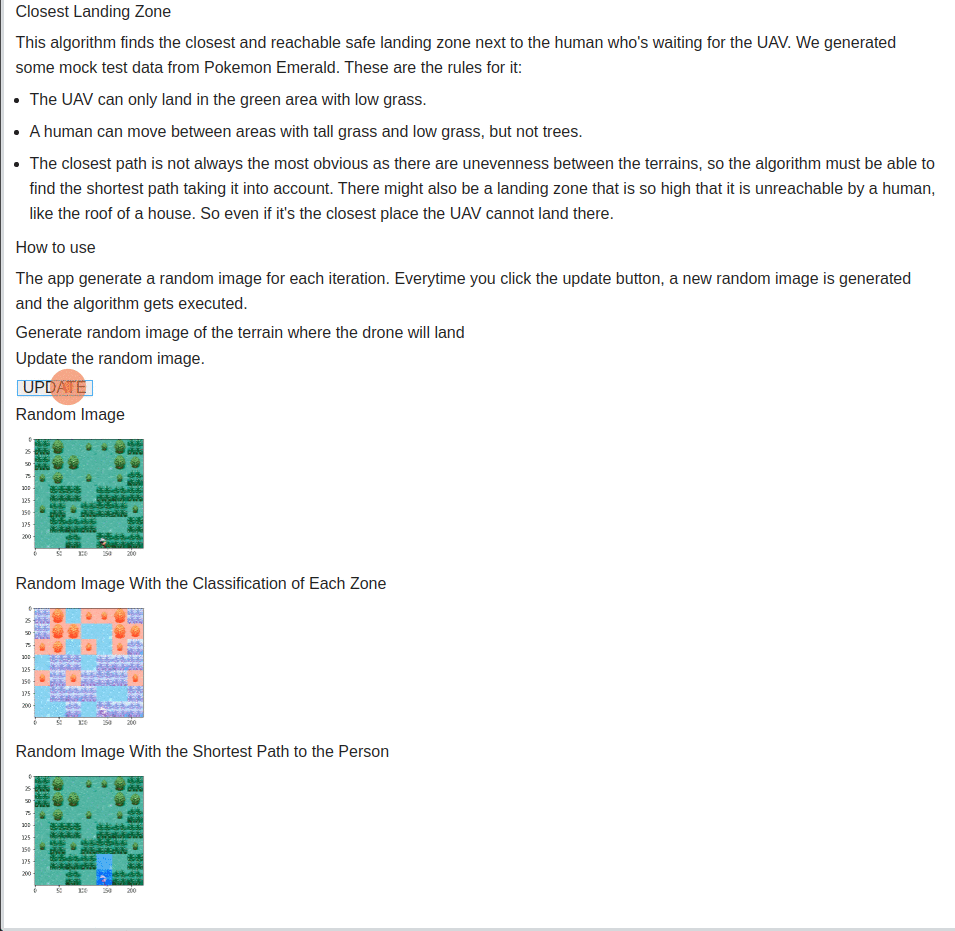

# Landing Zone Detection
Determine which of the reachable detected landing zones is closest to the person.

**List Number**: X 
**Discipline Subject**: Graphs II 

## Students
|Number | Student |
| -- | -- |
| 17/0146251  |  João Lucas Zarbiélli |
| 19/0046945  |  Leonardo Michalski Miranda |

## About

## App Gif

## Video (pt-br, [download link](https://raw.githubusercontent.com/projeto-de-algoritmos/Grafos2_LandingZoneDetection/main/assets/app_video.mp4))

## How to run
**Language**: Python. 
**Frameworks**: OpenCV; Jupyter Voilà; BinderHub. 
Access the [app](https://mybinder.org/v2/gh/projeto-de-algoritmos/Grafos2_ClosestLandingZone/main?urlpath=%2Fvoila%2Frender%2Fapp.ipynb) or the [notebook](https://mybinder.org/v2/gh/projeto-de-algoritmos/Grafos2_ClosestLandingZone/main?filepath=app.ipynb) with the BinderHub server.

## How to use

## References

Jupyter et al., "Binder 2.0 - Reproducible, Interactive, Sharable
Environments for Science at Scale." Proceedings of the 17th Python
in Science Conference. 2018. doi://10.25080/Majora-4af1f417-011
